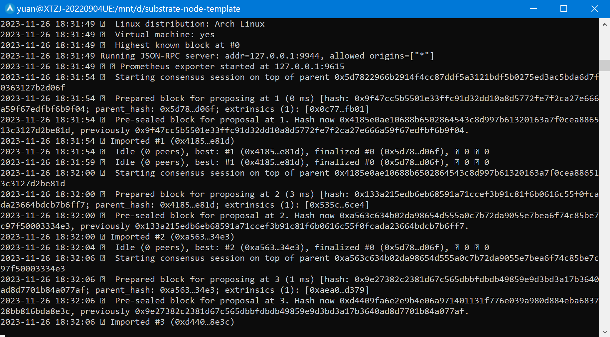

# substrate-node-template poe mod
releases:main
rustup:nightly-x86_64-unknown-linux-gnu
## build
```
cargo build --release
```
## run
```
./target/release/node-template --dev
```

## palkadot.js

### create


### revoke


### transfer


